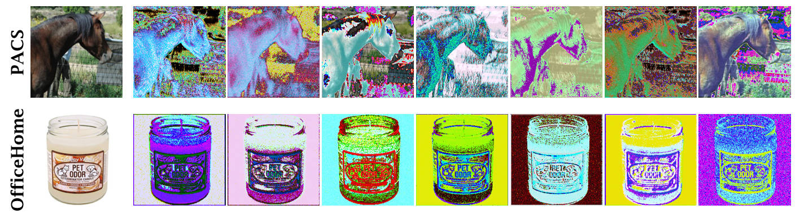

# C-UDA

This is the official code of our paper "**C**ontrastive Single Domain Generalization via **U**nsupervised **D**iversity **A**ugmentation."

___

### Requirements

- Linux
- Python 3.8
- Pytorch 1.8.0
- Torchvision 0.9.0
- NVIDIA GPU + CUDA CuDNN

### Dataset

**Note**: You need to download the data if you wish to train your own model.

Download the digits dataset from this [link](https://pan.baidu.com/s/15XTZxbFY_JnTk_FZB4-1Jw )[BaiDuYunDisk] and its extracted code: `xcl3`. Please extract it inside the `data` directory

```shell
cd data
unzip digits.zip
cd ..
```


### Train

**※ Pretrained model**

The model is available at this [link](https://pan.baidu.com/s/11rfaR-MA1BLejnHaCpQUTQ)[BaiDuYunDisk] and its extracted code:`n416`. Download and extract it in the `models_pth` directory.

**※ Training the model**

Coming soon.

### Testing

In [train.py](https://github.com/Ruiding1/C-UDA/blob/main/train.py):

- Specify the output directory to save the results in  `--dir`.
- Turn on the evaluation in `--eval`.
- Execute the following code.

```shell
python train.py
```


### Results

**※ Single domain generalization results on PACS**

> ResNet-18 is used for training.

| Methods  | A-C      | A-S      | A-P      | C-A      | C-S    | C-P      | S-A      | S-C      | S-P      | P-A      | P-C      | P-S      | Avg. |
| -------- | -------- | -------- | -------- | -------- | ------ | -------- | -------- | -------- | -------- | -------- | -------- | -------- | ---- |
| ERM      | 62.3     | 49.0     | 95.2     | 65.7     | 60.7   | 83.6     | 28.0     | 54.5     | 35.6     | 64.1     | 23.6     | 29.1     | 54.3 |
| JiGen    | 57.0     | 50.0     | 96.1     | 65.3     | 65.9   | 85.5     | 26.6     | 41.1     | 42.8     | 62.4     | 27.2     | 35.5     | 54.6 |
| ADA      | 64.3     | 58.5     | 94.5     | 66.7     | 65.6   | 83.6     | 37.0     | 58.6     | 41.6     | 65.3     | 32.7     | 35.9     | 58.7 |
| AugMix   | 68.4     | 54.6     | 95.2     | 74.3     | 66.7   | 87.3     | 40.0     | 57.4     | 46.8     | 67.3     | 26.8     | 41.4     | 59.6 |
| RandConv | 61.1     | 60.5     | 87.3     | 57.1     | 72.9   | 73.7     | 52.2     | 63.9     | 46.1     | 61.3     | 37.6     | 50.5     | 60.4 |
| RC+AM    | 65.7     | 68.2     | 93.2     | 71.9     | 74.2   | 86.0     | 40.2     | 62.9     | 49.1     | 68.5     | 43.5     | 53.3     | 64.7 |
| SagNet   | 67.1     | 56.8     | **95.7** | 72.1     | 69.2   | 85.7     | 41.1     | 62.9     | 46.2     | **69.8** | 35.1     | 40.7     | 61.9 |
| ALT_G    | 63.5     | 63.8     | 94.9     | 68.9     | 74.4   | 84.6     | 39.7     | 61.1     | 49.3     | 68.8     | 43.4     | 50.8     | 63.6 |
| Ours     | **69.7** | **74.5** | 92.9     | **74.9** | **75** | **87.5** | **55.6** | **66.2** | **52.4** | 68.0     | **51.1** | **70.7** | **69.9** |

**※  Image Generation Results**

>Compared to the original images (left),  Our method yields novel and diverse images.



### Acknowledgement

We thank the following authors for releasing their source code, data, and models:

- [Progressive Domain Expansion Network for Single Domain Generalization](https://arxiv.org/abs/2103.16050)
- [Learning to Diversify for Single Domain Generalization](https://arxiv.org/abs/2108.11726)
